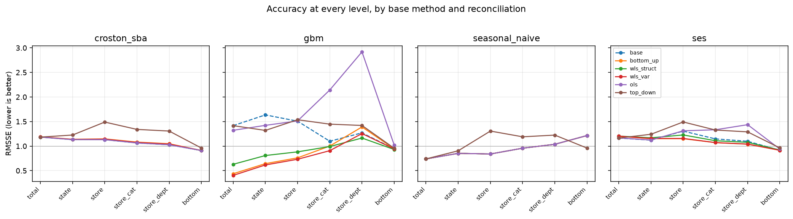
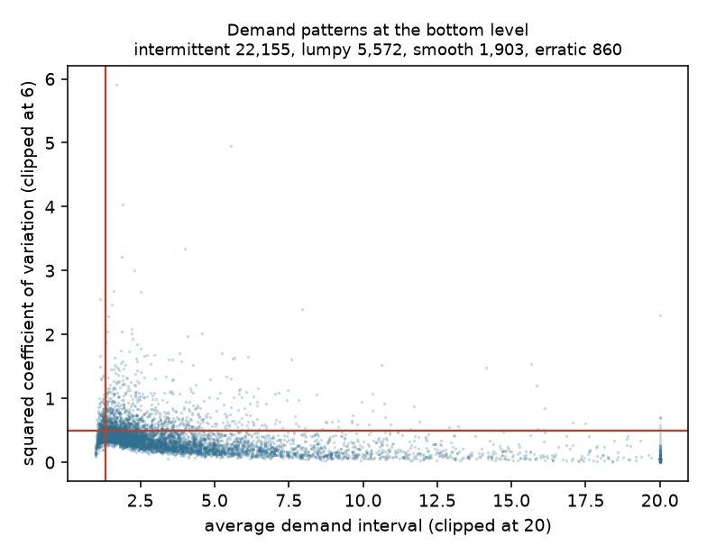

# Forecasts that have to add up

[](https://github.com/JAYANSHUBADLANI/hierarchical-forecasting/actions/workflows/pytest.yml)

A store forecast that does not sum to the region forecast is not a modelling
inconvenience. It is a plan nobody can act on, because two people reading two
levels of it see two different futures.

This measures what it costs to fix that, on the M5 retail data: 30,490 daily
series for Walmart items in individual stores, arranged into a six level tree,
forecast 28 days ahead, and reconciled six different ways. Every number below
came out of `make demo`; none of them was typed in by hand.

## The claim I started with, and what happened to it

> Optimal reconciliation beats bottom up and top down, but its advantage should
> shrink where the bottom series are intermittent, because it leans on base
> forecasts being decent and a mostly zero series does not forecast decently.

The first half held. The second half was wrong, and wrong in a direction worth
more than the original guess: **reconciliation helped most exactly where the base
forecast was worst, which was the intermittent series.** Where the seasonal naive
baseline is at its weakest, on intermittent items, borrowing strength from the
aggregates improved it by 22.7 percent, against 9.0 percent on the smooth ones.

The thing that actually predicts how much reconciliation buys is not
intermittency. It is how bad the base forecast already was at that level.

## The headline

The pooled gradient boosting model is a good bottom level forecaster and a bad
aggregate one, because nothing makes its 30,604 independent predictions agree.
Reconciling it against the tree fixes that. The size of the fix decays as you walk
down the hierarchy, and which weighting does the fixing changes on the way down:

| level | GBM alone | reconciled, wls_var | reconciled, wls_struct |
| --- | --- | --- | --- |
| total | 1.416 | **0.403** (72%) | 0.629 (56%) |
| state | 1.635 | **0.616** (62%) | 0.808 (51%) |
| store | 1.507 | **0.732** (51%) | 0.883 (41%) |
| store_cat | 1.099 | **0.907** (17%) | 0.991 (10%) |
| store_dept | 1.269 | 1.255 (1%) | **1.164** (8%) |
| bottom | 0.944 | 0.942 (0%) | **0.930** (1%) |

RMSSE, lower is better, 1.0 is the in sample seasonal naive error. Percentages are
improvement on the unreconciled GBM. Both columns are in
`outputs/tables/accuracy_by_level.csv`.

Variance weighting wins the top four levels by a wide margin and then loses both bottom
levels to structural weighting. I have not isolated why. The plausible reading is that
the variance weights are estimated, from residuals across 30,604 nodes, while the
structural weights are read off the shape of the tree and cannot be estimated badly, so
the estimated weights should hurt most where the series are shortest and sparsest. That
is a hypothesis about this result rather than something measured here.

That is the good news. The rest of this is the part I would want to be asked
about.

## Reconciliation is not free, and one method actively hurt

The same GBM forecasts, reconciled with ordinary least squares instead:

| level | GBM alone | GBM with OLS |
| --- | --- | --- |
| store_cat | 1.099 | 2.142 |
| store_dept | 1.269 | **2.919** |

OLS treats an error on the grand total and an error on one item in one store as
equally important. They are not, by about five orders of magnitude of volume, and
weighting them as if they were drags the middle of the tree badly off. This is
not a small effect at the edges. It more than doubled the error at the
department level.

The lesson I take from this is that reconciliation is a weighting decision
wearing the clothes of a consistency fix. Getting the weights wrong is worse than
not reconciling.

## Seasonal naive cannot be reconciled at all, and that is not a bug

The seasonal naive forecasts came out already coherent, exactly, before any
reconciliation. Every projection method returned them unchanged.

That surprised me until I wrote out why. Seasonal naive is a linear operator
applied identically to every series, so applying it to an aggregate gives the
same answer as aggregating the results of applying it to the parts. Coherence
survives it. The same is not true of simple exponential smoothing, whose per
series alpha breaks the symmetry, nor of Croston, nor of a pooled machine
learning model.

So how far a set of base forecasts is from adding up is a property of the method,
not of the data:

| base method | root forecast against the sum of its own bottom forecasts |
| --- | --- |
| seasonal naive | 0.00% |
| simple exponential smoothing | -2.38% |
| Croston with SBA | 0.37% |
| pooled gradient boosting | **-16.07%** |

The gradient boosting model's own top level forecast was 16 percent below the sum
of its own bottom level forecasts. Nothing in its training made those two numbers
have anything to do with each other.

## No single method wins everywhere

| level | best combination | RMSSE |
| --- | --- | --- |
| total | GBM + wls_var | 0.403 |
| state | GBM + wls_var | 0.616 |
| store | GBM + wls_var | 0.732 |
| store_cat | GBM + wls_var | 0.907 |
| store_dept | Croston SBA, unreconciled | 1.027 |
| bottom | Croston SBA | 0.910 |

Seasonal naive is the best unreconciled forecaster at the top (0.739) and the
worst at the bottom (1.215). Croston is the reverse. If a planning team wants one
number per level and wants those numbers to agree, they have to choose where to
be right first, and that choice is what reconciliation is actually for.



## Two things I had to get right before any of this meant anything

**The tree has to add up in the raw data.** I check it by computing every
aggregate twice, once through the sparse summing matrix and once through a pandas
groupby, and requiring exact agreement. Both paths give 66,927,173 units at every
one of the six levels, with a maximum absolute difference of zero. Two
independent paths agreeing is a real check. Building the aggregates one way and
then asserting they sum would only restate the construction, and there is a test
that deliberately corrupts the summing matrix to confirm the check would catch it.

**Days before an item existed are not days it sold nothing.** The file I use has
had the rows before each item's first recorded sale stripped out, so series start
on 1,652 different dates and only 23 percent of them span the full history. Not
one series has a zero in its first row, which is what tells you those rows were
removed rather than the item genuinely selling nothing.

Those days have to be zero for the tree to add up. But if you then measure a
series over that padded history, you are counting invented zeros as evidence
about its demand. Doing that moves 1,286 series into a more intermittent class
than they belong in, 4.2 percent of the panel, and inflates the median demand
interval from 2.72 to 3.75. So every per series statistic here runs over the days
that series was actually live, and the padded matrix is used only for
aggregation.



Ninety one percent of the bottom series are intermittent or lumpy: 22,155
intermittent, 5,572 lumpy, 1,903 smooth, 860 erratic, on the Syntetos and Boylan
(2005) cutoffs of 1.32 and 0.49.

## The part that took the most thinking: solving it at this size

Every projection method here is the solution of

    (S' W^-1 S) b = S' W^-1 yhat

The obvious route is to build that matrix and invert it. Here it is 30,490 by
30,490, roughly 7.4 GB dense, and it is dense rather than sparse because every
pair of bottom series shares the root node. That route is closed.

So I never form it. The system is symmetric positive definite, so I solve it by
conjugate gradient against an operator that only ever applies the sparse summing
matrix, at 183,000 non zeros per application. The result is the exact projection
to the requested tolerance rather than an approximation of it.

That worked immediately for OLS and failed completely for the variance weighted
version, which did not converge in 2,000 iterations. The reason is conditioning:
with variance weights the node weights span many orders of magnitude, from one
item in one store up to the grand total. Adding a Jacobi preconditioner fixed it,
and the preconditioner is free here because every entry of the summing matrix is
one, so the diagonal of the normal matrix is just `S' w_inv`.

| weighting | CG iterations per horizon step |
| --- | --- |
| OLS | 30 |
| structural | 13 |
| variance | 5, having not converged in 2,000 without preconditioning |

The whole study, four base methods at two forecast origins, six reconciliation
methods, scored at every level, runs in 72 seconds, and `make demo` end to end takes about ninety.

## What I did not do

MinT with a full shrunk covariance is not here. The covariance is 30,604 by
30,604, about 7.5 GB dense, and estimating it from 1,941 daily observations would
give a matrix of rank at most 1,941 anyway. What I use instead is the diagonal,
which is MinT's variance weighting without its off diagonal structure, and the
`wls_var` row is that. It is the single largest thing between this and the method
as it is usually written down, and I would not claim otherwise.

Beyond that: one retailer, one 28 day horizon, one cut of the hierarchy out of
several the M5 data supports, point forecasts only with no intervals, price
carried only as a feature rather than modelled, and no cross temporal
reconciliation across daily, weekly and monthly views.

The standard error column at the total level is empty because that level has one
node, so there is nothing to take a standard deviation over. I left it empty
rather than filling it with something that would look like a number.

## Reproducing this

```bash
make demo
```

That fetches the data, runs the study and writes every table and figure. The
whole thing is driven by one seed in `config/config.yaml`, currently 20260904.
Two consecutive runs produce byte identical result tables.

```bash
make test
```

35 tests. The ones worth reading are in `tests/test_reconcile.py`: that a
coherent forecast passes through projection unchanged, which is the strongest
correctness property these methods have, and that the conjugate gradient solution
matches the dense algebra on a hierarchy small enough to invert by hand.

## Layout

```
config/config.yaml          every knob, and the seed
src/hierforecast/
  data.py                   loading, and parsing the hierarchy out of the id string
  hierarchy.py              the summing matrix, and the coherence check
  intermittency.py          Syntetos and Boylan classification on live windows
  forecast.py               seasonal naive, SES, Croston with SBA, all vectorised
  gbm.py                    the pooled gradient boosting arm
  reconcile.py              bottom up, top down, middle out, and the CG projections
  metrics.py                RMSSE and MASE
  pipeline.py               the two forecast origins and the scoring
scripts/                    fetch, run the study, draw the figures
outputs/tables/             every number in this README
```
